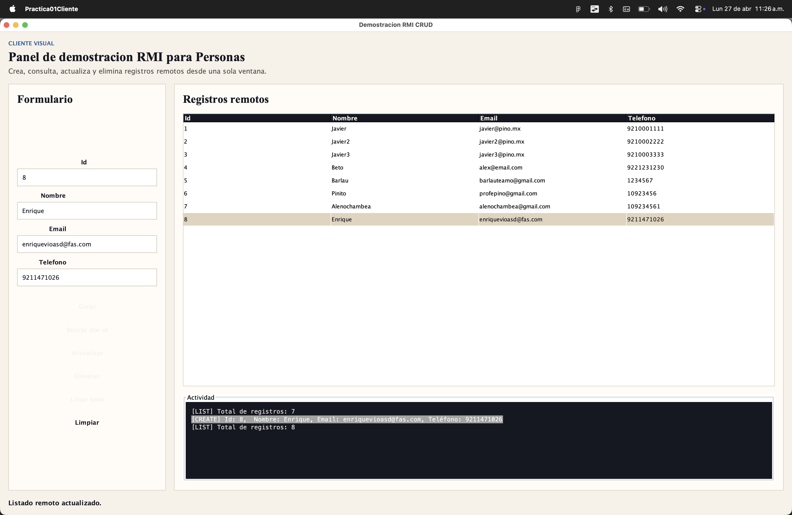
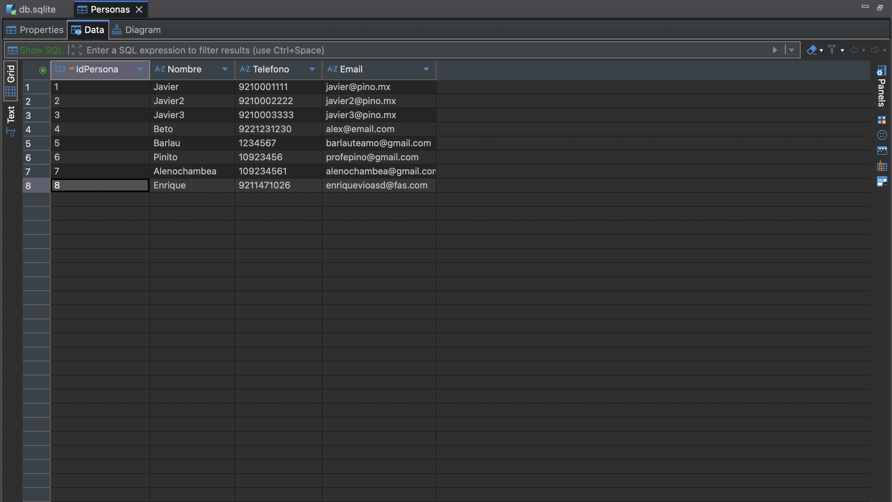

# Práctica RMI

Proyecto de ejemplo con Java RMI para manejar personas desde una interfaz grafica.

## Que hace

Este proyecto tiene dos partes:

- `practica01servidor`: levanta el servidor RMI y trabaja con la base de datos SQLite.
- `practica01cliente`: abre una ventana para registrar, buscar, actualizar y eliminar personas.

## Tecnologias

- Java
- Java RMI
- SQLite

## Estructura

```text
Práctica RMI/
├── practica01cliente/
├── practica01servidor/
├── docs/
└── db.sqlite
```

## Captura del frontend



## Captura de la base de datos

Vista de la tabla `personas` en DBeaver:



## Nota

Primero se debe ejecutar el servidor y despues el cliente.
